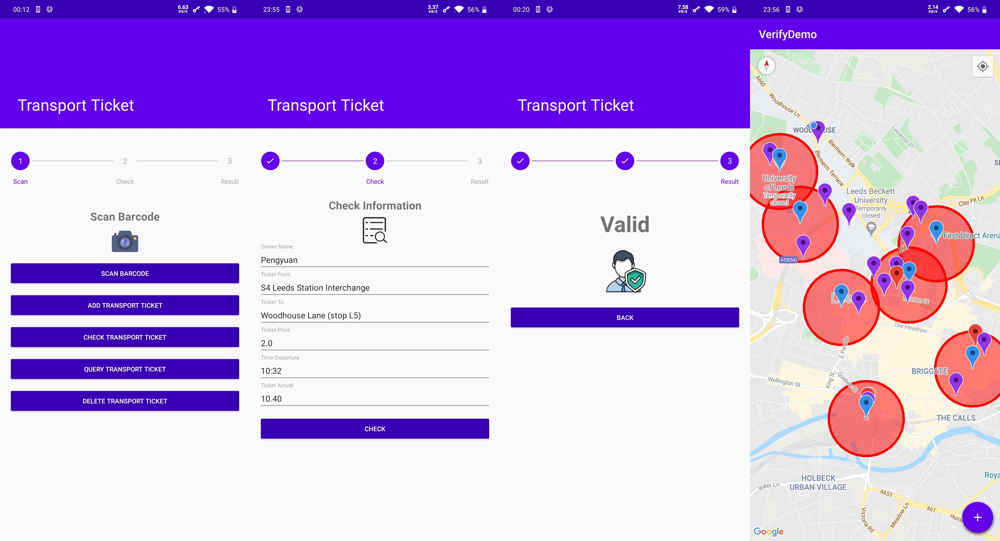
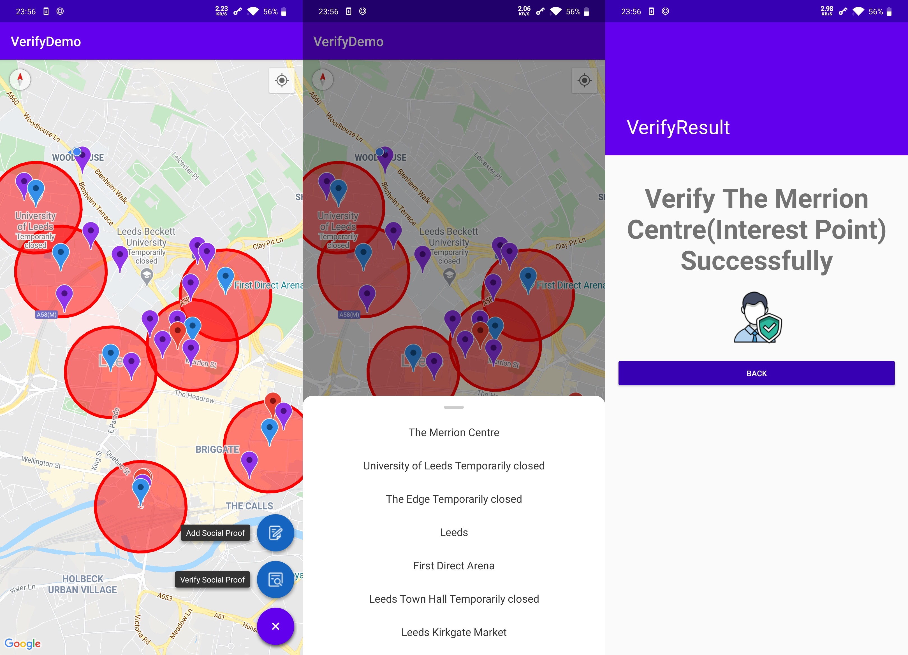

## Introduction

This project is using blockchain smart contracts that prove social claims (situation awareness) on the smart phone. It aims to provide a decentralized solution to achieve social proof. The main idea is for smart cities to store every records validation proof on a blockchain network. Once a record or information be committed on the blockchain, anyone is able to verify whether it is valid or not by the entity (Barcode, QR Code). For example, users can use smart phone to scan barcode to verify its validity, thus proving social claims that they have been to this interest point.

This project currently uses Ethereum as backing blockchain, and it has 6 scenarios of validation proof below (although they may not be very accurate, they can almost include the types of most places in the Google Map). People can choose to use different entity or physical information to implement social proof according to different locations.
* TransportTicket (train station, airport, etc.)
* Receipt (shopping mall, store, restaurant, etc.)
* IdCard (school, accomodation, workplace, government, etc.)
* Certificate (company, insurance agency, etc.)
* Ticket (park, museum, etc.)
* Prescription (hospital, pharmacy, etc.)

In addition, if users cannot proof they have been to a interest point directly (because some areas like parks are free for the public), secondary proof is also a solution. They can combine serval social proof points, and this system will allocate weights to them according to distance between social proof points and interest point from near to far, then calculate total weight to verfiy they meet requirements or not.

## Getting Started

### Android Application

verify-demo contains a Android application to interact with the smart contract.

#### Prerequisites

Android SDK installed.

Google Map API Key.

### Smart Contract

verify-sol contains a truffle project for ethereum smart contract management.

#### Prerequisites

Node.js installed.

web3j installed (version 4.2).

#### Installing Truflle

```shell
npm install -g truffle
```

#### Compiling the smart contract

```shell
truffle compile
```

#### Deploying the smart contract

```shell
# you could change the mnemonic and the address of ropsten in truffle-config.js
truffle migrate --network ropsten # --reset optional
```

#### Generating Java file

you can use web3j and truffle to generate java file according to the deployed smart contract.

```shell
web3j truffle generate [LOCATION]/verify-sol/build/contracts/Verify.json -o [LOCATION]/verify-demo/app/src/main/java/ -p ac.hurley.verifydemo.contract
```

## Usage

After deploying the smart contract, you can view the contract at address: https://ropsten.etherscan.io/address/YOUR_CONTRACT_ADDRESS, where each transaction record will be displayed.


After opening the Android application, give permission and enter the map. There may already be points of interest (blue marker) on the map, if not, users can also add interest point manually (click a place on the map, then click the info window, choose whether to add this point as interest point or social proof point). 

1. After adding **points of interest**, a blue marker will appear on the map, and a circle will appear to cover the range of points of interest on the map.

2. After adding **social proof point**, it will jump to corresponding type of interface to verify according to the type of the location clicked. By scanning the barcode to verify whether the information is valid (please give camera permission, and select PDF417 in settings of scanning interface if you want to scan barcode). If it is valid, there will be a social proof point marker on the map.

    

	Here are some test barcode or QR code images of places in Leeds, Uk, you can scan them (choose same place to add social proof ) to fill in the form:
    
    **Leeds General Infirmary**:
    
	
    
    **Central Village**:
    
	

	You can use more test images in image folder of source code position or you can also generate test data by yourself.

3. Select one point of interest to be verified by clicking the FloatingActionButton in the lower right corner of the screen, and then this system will assign weights to different social proof points according to the distance. If the total weights meets requirements, you can prove that you have been to this point of interest and implement social proof.

    

---

## Source code

Available at: https://github.com/epournaras/ProofOfSituationAwareness.

©Hurley. Released under the MIT License.